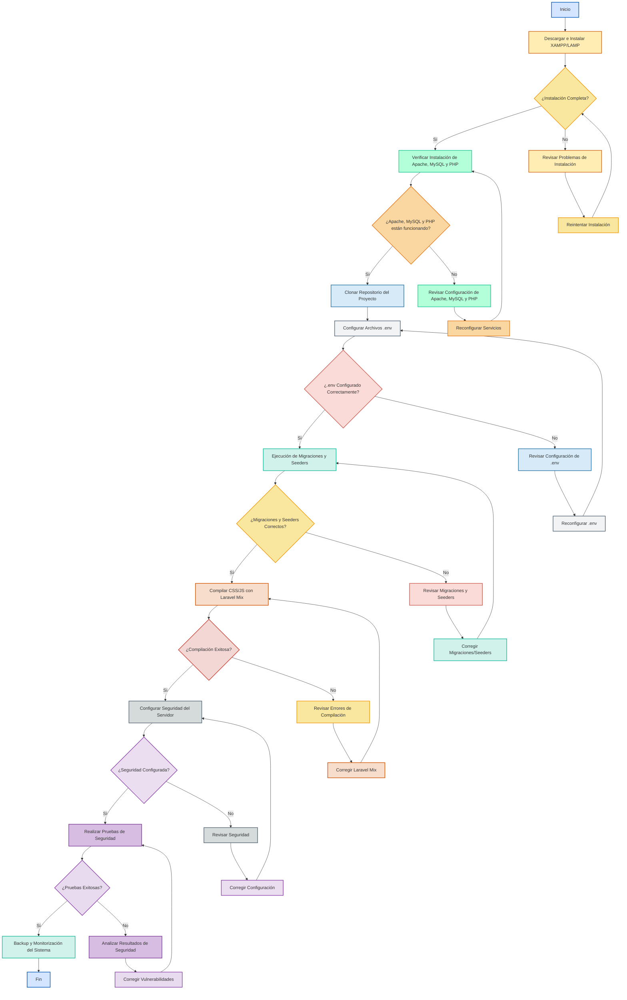

<div style="text-align: center;">
    
</div>

# Manual de Instalación y Configuración del Sistema Web Nutribite

<div style="text-align: center;">
    
</div>


## Índice
1. **Introducción**
2. **Requisitos del Sistema**
   - Requisitos de Hardware
   - Requisitos de Software
   - Configuración del Entorno
3. **Preparación del Entorno de Desarrollo**
   - Instalación de Software Necesario
   - Configuración del Servidor Local
   - Clonación del Repositorio
4. **Configuración del Servidor Web**
   - Configuración de XAMPP/LAMP
   - Configuración de PHP y MySQL
   - Instalación de Composer
   - Instalación y Configuración de Laravel
5. **Instalación de Dependencias**
   - Instalación de Node.js y npm
   - Instalación de Laravel Mix
   - Instalación de SCSS
6. **Despliegue del Sitio Web**
   - Configuración de Archivos `.env`
   - Ejecución de Migraciones y Seeders
   - Compilación de Archivos CSS/JS
7. **Configuración de Seguridad**
   - Seguridad del Servidor
   - Configuración de Firewalls y Certificados SSL
   - Pruebas de Seguridad
8. **Mantenimiento y Actualizaciones**
   - Actualización de Dependencias
   - Backup y Restauración del Sistema
   - Monitorización del Rendimiento
9. **Resolución de Problemas Comunes**
   - Errores de Instalación
   - Problemas de Conexión a la Base de Datos
   - Conflictos de Dependencias
10. **Conclusión**
11. **Anexos**
    - Comandos Útiles
    - Enlaces a Documentación Adicional

---

## 1. Introducción

Este manual está diseñado para guiar a cualquier usuario, sin importar su nivel de experiencia, en la instalación y configuración del sistema web Nutribite. Desde la preparación del entorno de desarrollo hasta el despliegue final en un servidor de producción, este documento cubre cada paso con el detalle necesario para garantizar una implementación exitosa. El objetivo es proporcionar una guía integral que permita a usuarios de diferentes edades y niveles de conocimiento llevar a cabo la instalación y configuración del sistema de manera autónoma.

## 2. Requisitos del Sistema

### Requisitos de Hardware

Para asegurar un rendimiento óptimo del sistema Nutribite, se recomiendan las siguientes especificaciones mínimas de hardware:

- **Procesador:** Intel Core i5 o superior.
- **Memoria RAM:** 8 GB como mínimo (16 GB recomendado para un rendimiento fluido y multitarea).
- **Almacenamiento:** Al menos 250 GB de espacio libre en disco duro.
- **Conexión a Internet:** Estable y de alta velocidad, preferiblemente de 50 Mbps o superior para manejar tareas de descarga e instalación.

### Requisitos de Software

El sistema Nutribite requiere un entorno de software actualizado para garantizar la compatibilidad y el rendimiento:

- **Sistema Operativo:**
  - **Linux:** Kali Linux, Parrot OS, Ubuntu 20.04 LTS o superior.
  - **Windows:** Windows 10 o 11.
- **Servidor Web:**
  - **Windows:** XAMPP (que incluye Apache, PHP, y MySQL).
  - **Linux:** LAMP stack (Apache, MySQL, PHP).
- **Base de Datos:** MySQL o MariaDB.
- **PHP:** Versión 7.4 o superior.
- **Node.js:** Versión 14 o superior para manejar dependencias de frontend.
- **Composer:** Administrador de dependencias para PHP.

### Configuración del Entorno

Es esencial que el entorno de desarrollo esté correctamente configurado para evitar problemas durante la instalación. Esto incluye asegurarse de que todos los requisitos de software estén instalados y actualizados a las versiones recomendadas. Además, se sugiere configurar un entorno de desarrollo local antes de proceder con la instalación del sistema en un entorno de producción.

## 3. Preparación del Entorno de Desarrollo

### Instalación de Software Necesario

Para comenzar, asegúrate de que todos los componentes esenciales estén instalados en tu sistema. Esto incluye el servidor web, la base de datos, PHP, y otros paquetes necesarios.

1. **Instalación de XAMPP en Windows:**
   - Descarga el instalador desde el sitio oficial de [Apache Friends](https://www.apachefriends.org/index.html).
   - Durante la instalación, selecciona los componentes necesarios, incluyendo Apache, MySQL, y PHP.
   - Completa la instalación siguiendo las instrucciones del asistente.

2. **Instalación de LAMP en Linux:**
   - Actualiza los paquetes del sistema:
     ```bash
     sudo apt update
     ```
   - Instala Apache:
     ```bash
     sudo apt install apache2
     ```
   - Instala MySQL:
     ```bash
     sudo apt install mysql-server
     ```
   - Instala PHP y los módulos necesarios:
     ```bash
     sudo apt install php libapache2-mod-php php-mysql
     ```

### Configuración del Servidor Local

Para asegurar que tu entorno de desarrollo funcione correctamente, es necesario configurar y verificar que todos los servicios estén operativos.

- **En Windows:** Abre el panel de control de XAMPP y verifica que los módulos de Apache y MySQL estén activos. Inicia ambos servicios si es necesario.
  
- **En Linux:** Asegúrate de que Apache y MySQL estén corriendo correctamente con los siguientes comandos:
  ```bash
  sudo systemctl status apache2
  sudo systemctl status mysql
  ```

### Clonación del Repositorio

Una vez que tu entorno de desarrollo esté configurado, el siguiente paso es obtener el código fuente del sistema Nutribite.

- Clona el proyecto desde GitHub utilizando Git:
  ```bash
  git clone https://github.com/tu_usuario/nutribite.git
  cd nutribite
  ```

## 4. Configuración del Servidor Web


La configuración del servidor web es una de las fases más críticas en el despliegue de un proyecto web. Asegurar que el servidor esté correctamente configurado es fundamental para garantizar que las aplicaciones web funcionen de manera eficiente, segura y escalable. El proceso de configuración del servidor incluye una serie de pasos que van desde la instalación de software esencial hasta la implementación de medidas de seguridad y la ejecución de pruebas de rendimiento.


El diagrama de flujo "## 4. Configuración del Servidor Web" se presenta como una guía visual clara y estructurada que detalla cada paso necesario para la correcta configuración del servidor web. Este enfoque permite a los administradores de sistemas, desarrolladores y cualquier persona involucrada en el proyecto seguir un procedimiento secuencial y lógico, minimizando la posibilidad de errores y garantizando que todas las tareas esenciales se realicen en el orden correcto.

##### 1. **Inicio del Proceso**
   - El proceso comienza con la descarga e instalación de XAMPP o LAMP, que son paquetes que contienen Apache, MySQL, y PHP, las herramientas básicas para correr un servidor web local. Este paso es crucial, ya que establece el entorno donde se desarrollará y probará la aplicación.

##### 2. **Verificación de Instalaciones**
   - Tras la instalación, se verifica que Apache, MySQL y PHP funcionen correctamente. Este paso asegura que los componentes esenciales del servidor estén operativos antes de continuar con configuraciones más avanzadas.

##### 3. **Configuración y Migración**
   - A continuación, se clona el repositorio del proyecto y se configuran los archivos `.env`, que contienen variables cruciales para el entorno de desarrollo. La correcta configuración de estos archivos es esencial para garantizar que el proyecto se comunique adecuadamente con la base de datos y otros servicios.

##### 4. **Compilación y Seguridad**
   - Una vez configurado el entorno, se procede a la compilación de archivos CSS/JS utilizando Laravel Mix, lo cual es necesario para optimizar los recursos frontend. Posteriormente, se configuran las medidas de seguridad del servidor, incluyendo firewall y SSL, para proteger la aplicación contra posibles amenazas.

##### 5. **Pruebas y Monitorización**
   - El proceso culmina con la realización de pruebas de seguridad para identificar y corregir posibles vulnerabilidades, y finalmente, la implementación de un sistema de backup y monitorización, lo que asegura la disponibilidad y seguridad continua del servidor.





### Configuración de XAMPP/LAMP

La correcta configuración del servidor web es crucial para el funcionamiento del sistema Nutribite. Esto incluye ajustar los puertos y verificar la ausencia de conflictos con otros servicios que puedan estar utilizando los mismos puertos.

- **Configuración de Apache:**
  - Abre el archivo de configuración de Apache (`httpd.conf`) y verifica o ajusta el puerto de escucha (`Listen 80`).
  - Asegúrate de que el módulo `mod_rewrite` esté habilitado, ya que es necesario para el funcionamiento de Laravel.
  
- **Configuración de MySQL:**
  - Configura MySQL para que acepte conexiones desde la aplicación, creando un usuario y una base de datos específicos para Nutribite.

### Configuración de PHP y MySQL

Es necesario habilitar ciertas extensiones de PHP para que el sistema funcione correctamente. Estas extensiones incluyen `pdo_mysql`, `mbstring`, y `openssl`.

- Abre el archivo `php.ini` y habilita las extensiones necesarias:
  ```ini
  extension=pdo_mysql
  extension=mbstring
  extension=openssl
  ```
- Reinicia Apache para que los cambios tengan efecto.

- **Creación de la base de datos:**
  - Accede a MySQL y crea la base de datos que utilizará Nutribite:
    ```sql
    CREATE DATABASE nutribite;
    ```

### Instalación de Composer

Composer es esencial para gestionar las dependencias de PHP en el proyecto Nutribite. Sigue los pasos a continuación para instalar Composer en tu sistema.

- **Instalación en Linux/Windows:**
  - Descarga e instala Composer ejecutando:
    ```bash
    curl -sS https://getcomposer.org/installer | php
    sudo mv composer.phar /usr/local/bin/composer
    ```

### Instalación y Configuración de Laravel

Laravel es el framework principal sobre el cual está construido el sistema Nutribite. Debes instalar Laravel de forma global en tu entorno.

- **Instalación de Laravel:**
  ```bash
  composer global require laravel/installer
  ```
- **Configuración del proyecto:**
  - Asegúrate de que el proyecto esté correctamente configurado con las rutas y directorios adecuados dentro de tu servidor.

## 5. Instalación de Dependencias

### Instalación de Node.js y npm

Node.js y npm son necesarios para manejar las dependencias de frontend, como Laravel Mix y SCSS.

- **Instalación en Linux:**
  ```bash
  sudo apt install nodejs npm
  ```
- **Instalación en Windows:**
  - Descarga e instala Node.js desde el sitio oficial [nodejs.org](https://nodejs.org).

### Instalación de Laravel Mix

Laravel Mix es una API fluida para definir compilaciones de webpack para tus proyectos de Laravel. Es necesario para compilar archivos CSS y JavaScript.

- Dentro del directorio del proyecto:
  ```bash
  npm install laravel-mix --save-dev
  ```

### Instalación de SCSS

SCSS (Sassy CSS) es una extensión de CSS que añade características como variables, anidamiento y mixins. Configúralo para la compilación automática:

- **Instalación de SCSS:**
  ```bash
  npm install sass --save-dev
  ```

## 6. Despliegue del Sitio Web

### Configuración de Archivos `.env`

El archivo `.env` es crucial para la configuración de tu aplicación Laravel. Define variables de entorno que incluyen la configuración

 de la base de datos, claves secretas, y otras configuraciones esenciales.

- **Configuración del archivo `.env`:**
  - Copia el archivo `.env.example` y renómbralo a `.env`.
  - Edita el archivo `.env` para que coincida con tu entorno de desarrollo, asegurándote de configurar correctamente la base de datos:
    ```env
    DB_CONNECTION=mysql
    DB_HOST=127.0.0.1
    DB_PORT=3306
    DB_DATABASE=nutribite
    DB_USERNAME=usuario
    DB_PASSWORD=contraseña
    ```

### Ejecución de Migraciones y Seeders

Las migraciones son necesarias para crear las tablas de la base de datos a partir de los modelos de Laravel. Los seeders permiten poblar la base de datos con datos iniciales.

- **Ejecución de Migraciones:**
  - Para crear las tablas en la base de datos, ejecuta:
    ```bash
    php artisan migrate
    ```
- **Ejecución de Seeders:**
  - Si es necesario, ejecuta los seeders para poblar la base de datos con datos de prueba:
    ```bash
    php artisan db:seed
    ```

### Compilación de Archivos CSS/JS

Para optimizar el rendimiento del sitio, es necesario compilar los archivos SCSS y JavaScript.

- **Compilación en modo desarrollo:**
  - Ejecuta el siguiente comando para compilar los archivos en modo desarrollo:
    ```bash
    npm run dev
    ```
- **Compilación en modo producción:**
  - Para compilar los archivos optimizados para producción, ejecuta:
    ```bash
    npm run prod
    ```

## 7. Configuración de Seguridad

### Seguridad del Servidor

La seguridad es un aspecto crítico del despliegue de cualquier aplicación web. Es esencial proteger el servidor y los datos del usuario.

- **Configuración de Firewall:**
  - Configura el firewall para permitir solo los puertos necesarios (80 para HTTP y 443 para HTTPS).
  - Bloquea todos los demás puertos no esenciales para reducir la superficie de ataque.
  
- **Instalación de Certificados SSL:**
  - Los certificados SSL son esenciales para asegurar las comunicaciones entre el cliente y el servidor. Instala Certbot para obtener un certificado SSL gratuito de Let's Encrypt:
    ```bash
    sudo apt install certbot python3-certbot-apache
    sudo certbot --apache
    ```
  - Sigue las instrucciones para completar la instalación del certificado SSL y configura Apache para usar HTTPS.

### Pruebas de Seguridad

Antes de poner el sitio en producción, es fundamental realizar pruebas de seguridad para identificar posibles vulnerabilidades.

- **Pruebas de penetración:**
  - Realiza pruebas básicas de penetración utilizando herramientas como `nmap` o `OWASP ZAP`.
  
- **Revisión de logs:**
  - Monitorea los logs de Apache y MySQL para detectar posibles intentos de acceso no autorizado.

## 8. Mantenimiento y Actualizaciones

### Actualización de Dependencias

Mantener las dependencias actualizadas es crucial para la seguridad y el rendimiento del sistema.

- **Actualización de Composer:**
  ```bash
  composer update
  ```
- **Actualización de npm:**
  ```bash
  npm update
  ```

### Backup y Restauración del Sistema

Es esencial realizar copias de seguridad regulares de la base de datos y de los archivos del sistema para evitar la pérdida de datos.

- **Backup de la base de datos:**
  ```bash
  mysqldump -u usuario -p nutribite > backup.sql
  ```
  
- **Restauración de la base de datos:**
  ```bash
  mysql -u usuario -p nutribite < backup.sql
  ```

### Monitorización del Rendimiento

Monitorizar el rendimiento del servidor ayuda a identificar y resolver cuellos de botella antes de que afecten a los usuarios.

- **Herramientas de monitorización:**
  - Utiliza herramientas como `htop` para monitorear el uso de CPU y memoria.
  - Instala `MySQLTuner` para optimizar el rendimiento de la base de datos.
  - Considera herramientas como `New Relic` para un monitoreo más avanzado.

## 9. Resolución de Problemas Comunes

### Errores de Instalación

Al instalar el sistema Nutribite, es posible que surjan problemas. Aquí se abordan los más comunes.

- **Problemas de permisos:**
  - Asegúrate de que los directorios de tu proyecto tengan los permisos adecuados:
    ```bash
    sudo chown -R www-data:www-data /ruta/a/tu/proyecto
    sudo chmod -R 755 /ruta/a/tu/proyecto
    ```

### Problemas de Conexión a la Base de Datos

Si el sistema no puede conectarse a la base de datos, verifica lo siguiente:

- **Revisa las credenciales en el archivo `.env`:**
  - Asegúrate de que el usuario, la contraseña y el nombre de la base de datos sean correctos.
  
- **Verifica que MySQL esté corriendo:**
  ```bash
  sudo systemctl status mysql
  ```

### Conflictos de Dependencias

Los conflictos de dependencias pueden surgir cuando las versiones de los paquetes no son compatibles entre sí.

- **Solución de conflictos con Composer:**
  ```bash
  composer install --no-dev
  ```
- **Solución de conflictos con npm:**
  ```bash
  npm install --legacy-peer-deps
  ```

## 10. Conclusión

Este manual ofrece una guía completa para la instalación y configuración del sistema web Nutribite. Sigue cada sección con cuidado para asegurar una instalación exitosa. Recuerda siempre mantener el sistema actualizado y realizar copias de seguridad periódicas para proteger los datos.

## 11. Anexos

### Comandos Útiles

A continuación se presentan algunos comandos útiles para la administración del sistema Nutribite:

- **Iniciar el servidor local de Laravel:**
  ```bash
  php artisan serve
  ```
  
- **Compilar recursos en modo producción:**
  ```bash
  npm run prod
  ```

### Enlaces a Documentación Adicional

Para obtener más información, consulta la documentación oficial de las siguientes herramientas:

- [Laravel](https://laravel.com/docs)
- [Composer](https://getcomposer.org/doc/)
- [Node.js](https://nodejs.org/en/docs/)
- [Apache](https://httpd.apache.org/docs/)
- [MySQL](https://dev.mysql.com/doc/)


