<div style="text-align: center;">
    
</div>

# Manual de Usuario - Plataforma Nutribite

<div style="text-align: center;">
    
</div>

## Índice

1. [Introducción](#introducción)
2. [Requisitos del Sistema](#requisitos-del-sistema)
3. [Instalación y Configuración](#instalación-y-configuración)
   - [Instalación](#instalación)
   - [Configuración Básica](#configuración-básica)
   - [Configuración Avanzada](#configuración-avanzada)
   - [Gestión de Múltiples Proyectos](#gestión-de-múltiples-proyectos)
4. [Navegación y Uso del Sitio Web](#navegación-y-uso-del-sitio-web)
   - [Inicio de Sesión](#inicio-de-sesión)
   - [Exploración del Sitio](#exploración-del-sitio)
   - [Formulario de Contacto](#formulario-de-contacto)
   - [Gestión de Recetas](#gestión-de-recetas)
   - [Administración de Planes de Nutrición](#administración-de-planes-de-nutrición)
5. [Seguridad del Sitio](#seguridad-del-sitio)
   - [Mecanismos de Autenticación](#mecanismos-de-autenticación)
   - [Mitigación de Amenazas Comunes](#mitigación-de-amenazas-comunes)
   - [Cifrado de Datos y Protección](#cifrado-de-datos-y-protección)
   - [Implementación de Medidas de Seguridad Adicionales](#implementación-de-medidas-de-seguridad-adicionales)
   - [Análisis Forense de Incidentes de Seguridad](#análisis-forense-de-incidentes-de-seguridad)
   - [Políticas de Seguridad en Kali Linux](#políticas-de-seguridad-en-kali-linux)
6. [Mantenimiento y Gestión del Sitio](#mantenimiento-y-gestión-del-sitio)
   - [Actualización de Contenidos](#actualización-de-contenidos)
   - [Gestión Avanzada de Usuarios](#gestión-avanzada-de-usuarios)
   - [Respaldo y Recuperación de Datos](#respaldo-y-recuperación-de-datos)
   - [Optimización y Mantenimiento de Código SCSS](#optimización-y-mantenimiento-de-código-scss)
7. [Solución de Problemas](#solución-de-problemas)
   - [Diagnóstico de Problemas Comunes](#diagnóstico-de-problemas-comunes)
   - [Auditoría de Seguridad y Corrección de Vulnerabilidades](#auditoría-de-seguridad-y-corrección-de-vulnerabilidades)
   - [Configuración y Validación de Formularios](#configuración-y-validación-de-formularios)
8. [Soporte Técnico y Recursos Adicionales](#soporte-técnico-y-recursos-adicionales)

## Introducción

El presente manual de usuario tiene como objetivo proporcionar una guía exhaustiva para la implementación, configuración y operación del sitio web de Nutribite, una plataforma web diseñada para ofrecer soluciones integrales en nutrición y bienestar. Este documento aborda aspectos clave de seguridad, administración de contenidos y optimización del código, asegurando que los usuarios puedan sacar el máximo provecho de las funcionalidades ofrecidas.

## Requisitos del Sistema

Para garantizar un rendimiento óptimo de la plataforma Nutribite, se deben cumplir los siguientes requisitos del sistema:

- **Navegador Web Recomendado:** Google Chrome, Mozilla Firefox, Safari, Microsoft Edge (última versión).
- **Resolución de Pantalla:** 1366x768 píxeles o superior.
- **Servidor Web:** Apache o Nginx.
- **PHP:** Versión 7.4 o superior.
- **Base de Datos:** MySQL 5.7 o superior, o MariaDB 10.2 o superior.
- **Sistema Operativo:** Preferiblemente basado en Linux, como Ubuntu, Debian, Kali Linux o Parrot OS.
- **Conexión a Internet:** Banda ancha estable con una velocidad mínima de 10 Mbps.

## Instalación y Configuración

### Instalación

1. **Clonación del Repositorio:**
   Utilice el siguiente comando para clonar el repositorio oficial de Nutribite:
   ```bash
   git clone https://github.com/usuario/nutribite.git
   ```

2. **Acceso al Directorio del Proyecto:**
   Navegue al directorio del proyecto clonado:
   ```bash
   cd nutribite
   ```

3. **Instalación de Dependencias:**
   Ejecute los siguientes comandos para instalar las dependencias necesarias:
   ```bash
   composer install
   npm install && npm run dev
   ```

4. **Configuración del Archivo `.env`:**
   - Duplique el archivo `.env.example` y renómbrelo como `.env`.
   - Configure las variables de entorno, incluyendo los detalles de la base de datos y claves API.

5. **Generación de la Clave de Aplicación:**
   Ejecute el siguiente comando para generar una clave segura para la aplicación:
   ```bash
   php artisan key:generate
   ```

6. **Migraciones y Seeders:**
   Ejecute las migraciones de la base de datos y seeders para poblar las tablas con datos iniciales:
   ```bash
   php artisan migrate --seed
   ```

### Configuración Básica

1. **Configuración del Servidor Web:**
   - Asegúrese de que el servidor Apache o Nginx esté configurado para apuntar al directorio `public` del proyecto.
   - Habilite el módulo de reescritura (`mod_rewrite`) en Apache o el equivalente en Nginx para manejar rutas amigables.

2. **Permisos de Directorio:**
   Asigne los permisos de escritura adecuados a los directorios críticos:
   ```bash
   chmod -R 775 storage bootstrap/cache
   ```

### Configuración Avanzada

1. **Definición del Entorno:**
   - Establezca `APP_ENV` como `production` para el entorno en vivo.
   - Configure `APP_DEBUG` como `false` en producción para ocultar mensajes de error.

2. **Optimización de Caché:**
   Mejore la eficiencia de la aplicación utilizando los siguientes comandos:
   ```bash
   php artisan config:cache
   php artisan route:cache
   ```

3. **Compilación de Assets para Producción:**
   Compile y optimice los archivos SCSS y JavaScript para un entorno de producción:
   ```bash
   npm run prod
   ```

### Gestión de Múltiples Proyectos

1. **Estructura del Directorio de Proyectos:**
   Los proyectos de Laravel pueden residir en `/opt/lampp/htdocs`. Para proyectos múltiples, cada uno debe tener su propio subdirectorio.

2. **Configuración de Virtual Hosts:**
   Configure `Virtual Hosts` en Apache o `server blocks` en Nginx para permitir el acceso a cada proyecto a través de URLs específicas como `localhost/proyectoA`.

3. **Separación de Bases de Datos:**
   Asegúrese de que cada proyecto tenga su propia base de datos, garantizando una administración segura y sin conflictos.

## Navegación y Uso del Sitio Web

### Inicio de Sesión

1. **Acceso a la Plataforma:**
   Ingrese a la plataforma Nutribite mediante la URL oficial `https://tusitioweb.com/login`.

2. **Recuperación de Credenciales:**
   En caso de olvido de contraseña, utilice la funcionalidad "Olvidé mi contraseña" para restablecerla mediante un correo electrónico seguro.

### Exploración del Sitio

Nutribite está organizado en secciones clave accesibles desde el menú principal:

- **Inicio:** Proporciona una visión general de la plataforma.
- **Nosotros:** Información sobre la misión, visión y valores de Nutribite.
- **Especialistas:** Perfil de los profesionales asociados a la plataforma.
- **Planes:** Descripción detallada de los planes de nutrición disponibles.
- **Recetas:** Recetario de opciones saludables y nutritivas.
- **Contacto:** Información de contacto y formulario para consultas.
- **Ubicación:** Mapa interactivo con la ubicación de las oficinas de Nutribite.

### Formulario de Contacto

1. **Validación de Campos:**
   - **Nombre:** Solo se aceptan caracteres alfabéticos.
   - **Teléfono:** Debe comenzar con el prefijo `+56` y aceptar solo números.
   - **RUT:** Validación del formato chileno `11.111.111-1`.
   - **Mensaje:** Texto libre con validación de longitud mínima y máxima.

2. **Envió de Consultas:**
   Después de completar el formulario, haga clic en "Enviar". La plataforma confirmará la recepción o indicará cualquier error.

### Gestión de Recetas

1. **Visualización de Recetas:**
   Las recetas se muestran en un formato de tarjetas, organizadas en filas de tres columnas. Cada tarjeta incluye una imagen, el nombre de la receta y una breve descripción.

2. **Acceso a Detalles de Recetas:

**
   Al seleccionar una receta, se despliega una vista detallada con la lista de ingredientes, pasos de preparación y valores nutricionales.

### Administración de Planes de Nutrición

1. **Exploración de Planes:**
   Los planes están organizados en una tabla que presenta servicios, duraciones y costos asociados.

2. **Contratación de Planes:**
   Los usuarios pueden contratar un plan directamente desde el sitio, con opciones de pago en línea y asistencia profesional.

## Seguridad del Sitio

### Mecanismos de Autenticación

1. **Cifrado de Contraseñas:**
   Las contraseñas de los usuarios se cifran con `bcrypt`, garantizando que no se almacenen en texto claro.

2. **Política de Contraseñas:**
   Se requiere que las contraseñas contengan al menos 8 caracteres, combinando letras, números y símbolos, con un cambio obligatorio cada 90 días.

3. **Autenticación Multifactor (MFA):**
   Se recomienda habilitar MFA, utilizando aplicaciones como Google Authenticator para añadir una capa adicional de seguridad.

### Mitigación de Amenazas Comunes

1. **Prevención de Inyecciones SQL:**
   Todas las consultas a la base de datos se parametrizan para prevenir inyecciones SQL. Laravel Eloquent ORM maneja automáticamente la sanitización de entradas.

2. **Protección CSRF:**
   Los formularios están protegidos con tokens CSRF (`Cross-Site Request Forgery`), validando cada solicitud POST para asegurar su procedencia.

3. **Protección XSS:**
   Las salidas de datos hacia el frontend se escapan adecuadamente para evitar la inyección de scripts maliciosos, reforzando la seguridad con políticas de contenido seguro (CSP).

### Cifrado de Datos y Protección

1. **Certificado SSL/TLS:**
   El sitio utiliza un certificado SSL para cifrar todas las comunicaciones entre el servidor y los usuarios, garantizando la privacidad de los datos.

2. **Almacenamiento Seguro:**
   Los datos sensibles, como contraseñas y tokens, se almacenan utilizando cifrado AES-256, con políticas de acceso estrictas para proteger la base de datos.

### Implementación de Medidas de Seguridad Adicionales

1. **Limitación de Intentos de Inicio de Sesión:**
   Se bloquea la cuenta tras 5 intentos fallidos de inicio de sesión, con un bloqueo temporal de 15 minutos para prevenir ataques de fuerza bruta.

2. **Monitoreo de Actividades:**
   Todas las actividades críticas se registran en logs seguros, incluyendo intentos fallidos de inicio de sesión y cambios en la configuración.

3. **Actualizaciones de Seguridad:**
   Se recomienda mantener el framework Laravel y las dependencias actualizadas para proteger la aplicación contra vulnerabilidades conocidas.

### Análisis Forense de Incidentes de Seguridad

Tras un incidente de phishing, se realizó un análisis forense que reveló la afectación de datos personales de un usuario. Se tomaron medidas correctivas, incluyendo la capacitación del personal sobre seguridad y el fortalecimiento de las protecciones contra ingeniería social.

### Políticas de Seguridad en Kali Linux

Para asegurar el entorno de desarrollo en Kali Linux, se implementaron las siguientes políticas:

1. **Cierre de Puertos No Utilizados:**
   Se identificaron y cerraron puertos abiertos innecesarios utilizando `netstat` y `ufw`.

2. **Configuración de Firewall:**
   Se configuraron reglas estrictas de firewall para permitir solo el tráfico necesario, bloqueando cualquier intento de acceso no autorizado.

3. **Desactivación de Servicios Innecesarios:**
   Se desactivaron servicios no críticos utilizando `systemctl`, minimizando la superficie de ataque.

4. **Actualización Continua:**
   Se mantuvieron los paquetes y el sistema operativo actualizados con `apt-get update && apt-get upgrade` para garantizar que todos los componentes estuvieran protegidos con los últimos parches de seguridad.

## Mantenimiento y Gestión del Sitio

### Actualización de Contenidos

1. **Acceso al Panel de Administración:**
   Los administradores pueden iniciar sesión en el panel y seleccionar la sección que necesitan actualizar.

2. **Edición de Contenidos:**
   El editor visual permite modificar textos, imágenes y otros contenidos. Todos los cambios deben ser revisados en un entorno de prueba antes de ser publicados.

### Gestión Avanzada de Usuarios

1. **Administración de Usuarios:**
   Los administradores pueden crear, editar y eliminar usuarios, asignando roles y permisos adecuados para cada usuario según sus funciones.

2. **Roles y Permisos:**
   Es fundamental limitar el acceso a funciones críticas solo al personal autorizado para proteger la integridad y seguridad del sitio.

### Respaldo y Recuperación de Datos

1. **Respaldo Automático:**
   Se recomienda configurar tareas cron para realizar respaldos automáticos de la base de datos y contenidos, almacenándolos en ubicaciones seguras.

2. **Recuperación de Datos:**
   En caso de fallo, los datos pueden ser restaurados desde los respaldos utilizando las herramientas disponibles en el panel de administración.

### Optimización y Mantenimiento de Código SCSS

1. **Uso de Variables SCSS:**
   Se utilizaron variables SCSS para manejar colores, tamaños y fuentes, lo que facilita cambios globales en la apariencia del sitio.

2. **Modularización del Código:**
   El código SCSS se dividió en módulos específicos para cada componente, facilitando su mantenimiento y escalabilidad.

3. **Documentación del Código:**
   Se añadieron comentarios claros y precisos en el código SCSS, describiendo el propósito de cada bloque y mejorando la legibilidad.

4. **Eliminación de Redundancias:**
   Se eliminaron duplicaciones en el código mediante el uso de mixins y funciones SCSS, optimizando la eficiencia del sitio.

## Solución de Problemas

### Diagnóstico de Problemas Comunes

1. **Acceso a la Plataforma:**
   Si no puede iniciar sesión, verifique las credenciales. Si olvidó su contraseña, utilice la opción de recuperación.

2. **Problemas de Carga del Sitio:**
   Asegúrese de que el servidor esté activo y revise los logs para identificar posibles errores que estén afectando el rendimiento.

### Auditoría de Seguridad y Corrección de Vulnerabilidades

1. **Revisión de Logs:**
   Los logs de seguridad están disponibles en `/var/logs/laravel.log`, donde se pueden revisar intentos de acceso no autorizados.

2. **Escaneo de Vulnerabilidades:**
   Realice auditorías de seguridad periódicas utilizando herramientas como `OWASP ZAP` o `Nikto`, corrigiendo cualquier vulnerabilidad detectada.

3. **Notificaciones de Seguridad:**
   Configure alertas para recibir notificaciones inmediatas sobre actividades sospechosas, permitiendo una respuesta rápida ante cualquier amenaza.

### Configuración y Validación de Formularios

1. **Validación de Datos:**
   Los formularios están configurados para validar entradas según las reglas específicas (caracteres alfabéticos, formatos numéricos, etc.).

2. **Sanitización Automática:**
   Los campos críticos, como el RUT y el correo electrónico, se sanitizan automáticamente antes de ser enviados para garantizar la integridad de los datos.

## Soporte Técnico y Recursos Adicionales

Para asistencia técnica y acceso a recursos adicionales, contacte al equipo de soporte de Nutribite a través del correo soporte@nutribite.com o llamando al número +56 9 1234 5678. También puede consultar la documentación técnica completa y acceder a guías adicionales en la plataforma de soporte de Nutribite.

Aquí se representa la estructura del manual de usuario en un diagrama de flujo del sitio Nutribite. Este gráfico ayuda a visualizar la estructura del documento y las relaciones entre las diferentes secciones.

```mermaid
graph TD;
    A[Manual de Usuario - Nutribite] --> B1[Introducción]
    A --> B2[Requisitos del Sistema]
    A --> B3[Instalación y Configuración]
    B3 --> C1[Instalación]
    B3 --> C2[Configuración Básica]
    B3 --> C3[Configuración Avanzada]
    B3 --> C4[Gestión de Múltiples Proyectos]
    A --> B4[Navegación y Uso del Sitio Web]
    B4 --> D1[Inicio de Sesión]
    B4 --> D2[Exploración del Sitio]
    B4 --> D3[Formulario de Contacto]
    B4 --> D4[Gestión de Recetas]
    B4 --> D5[Administración de Planes de Nutrición]
    A --> B5[Seguridad del Sitio]
    B5 --> E1[Mecanismos de Autenticación]
    B5 --> E2[Mitigación de Amenazas Comunes]
    B5 --> E3[Cifrado de Datos y Protección]
    B5 --> E4[Medidas de Seguridad Adicionales]
    B5 --> E5[Análisis Forense de Incidentes de Seguridad]
    B5 --> E6[Políticas de Seguridad en Kali Linux]
    A --> B6[Mantenimiento y Gestión del Sitio]
    B6 --> F1[Actualización de Contenidos]
    B6 --> F2[Gestión Avanzada de Usuarios]
    B6 --> F3[Respaldo y Recuperación de Datos]
    B6 --> F4[Optimización y Mantenimiento de Código SCSS]
    A --> B7[Solución de Problemas]
    B7 --> G1[Diagnóstico de Problemas Comunes]
    B7 --> G2[Auditoría de Seguridad y Corrección de Vulnerabilidades]
    B7 --> G3[Configuración y Validación de Formularios]
    A --> B8[Soporte Técnico y Recursos Adicionales]

    %% Colores personalizados
    style A fill:#2ECC71,stroke:#27AE60,stroke-width:4px;
    style B1 fill:#3498DB,stroke:#2980B9,stroke-width:2px;
    style B2 fill:#3498DB,stroke:#2980B9,stroke-width:2px;
    style B3 fill:#3498DB,stroke:#2980B9,stroke-width:2px;
    style B4 fill:#3498DB,stroke:#2980B9,stroke-width:2px;
    style B5 fill:#E74C3C,stroke:#C0392B,stroke-width:2px;
    style B6 fill:#3498DB,stroke:#2980B9,stroke-width:2px;
    style B7 fill:#E74C3C,stroke:#C0392B,stroke-width:2px;
    style B8 fill:#3498DB,stroke:#2980B9,stroke-width:2px;

    style C1 fill:#F1C40F,stroke:#F39C12,stroke-width:2px;
    style C2 fill:#F1C40F,stroke:#F39C12,stroke-width:2px;
    style C3 fill:#F1C40F,stroke:#F39C12,stroke-width:2px;
    style C4 fill:#F1C40F,stroke:#F39C12,stroke-width:2px;

    style D1 fill:#8E44AD,stroke:#71368A,stroke-width:2px;
    style D2 fill:#8E44AD,stroke:#71368A,stroke-width:2px;
    style D3 fill:#8E44AD,stroke:#71368A,stroke-width:2px;
    style D4 fill:#8E44AD,stroke:#71368A,stroke-width:2px;
    style D5 fill:#8E44AD,stroke:#71368A,stroke-width:2px;

    style E1 fill:#E67E22,stroke:#D35400,stroke-width:2px;
    style E2 fill:#E67E22,stroke:#D35400,stroke-width:2px;
    style E3 fill:#E67E22,stroke:#D35400,stroke-width:2px;
    style E4 fill:#E67E22,stroke:#D35400,stroke-width:2px;
    style E5 fill:#E67E22,stroke:#D35400,stroke-width:2px;
    style E6 fill:#E67E22,stroke:#D35400,stroke-width:2px;

    style F1 fill:#1ABC9C,stroke:#16A085,stroke-width:2px;
    style F2 fill:#1ABC9C,stroke:#16A085,stroke-width:2px;
    style F3 fill:#1ABC9C,stroke:#16A085,stroke-width:2px;
    style F4 fill:#1ABC9C,stroke:#16A085,stroke-width:2px;

    style G1 fill:#E74C3C,stroke:#C0392B,stroke-width:2px;
    style G2 fill:#E74C3C,stroke:#C0392B,stroke-width:2px;
    style G3 fill:#E74C3C,stroke:#C0392B,stroke-width:2px;
```

