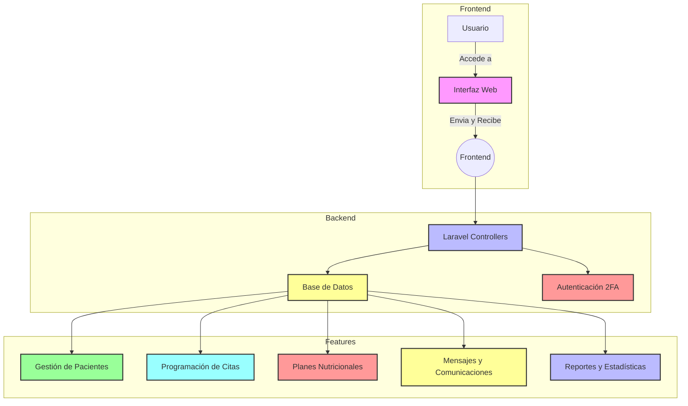

<div style="text-align: center;">
     
      
</div>

# Nutribite

## Descripción del Proyecto

Nutribite es una plataforma web diseñada para brindar a los usuarios acceso a recursos y servicios relacionados con la nutrición, la salud y el bienestar. El proyecto está enfocado en ofrecer herramientas que permitan a los especialistas en nutrición gestionar sus pacientes, programar citas, crear planes nutricionales personalizados, y llevar un control exhaustivo de las comunicaciones y reportes estadísticos.

## Funcionalidades Principales

- **Gestión de Pacientes**: Los nutricionistas pueden registrar y administrar la información de sus pacientes, incluyendo datos de contacto, historial médico y notas de cada consulta.

- **Programación de Citas**: El sistema permite a los nutricionistas y a los pacientes agendar citas, ya sea de manera presencial u online, con la posibilidad de seleccionar entre diferentes horarios disponibles.

- **Planes Nutricionales**: Los especialistas pueden crear y gestionar planes nutricionales personalizados para sus pacientes, adaptados a sus necesidades individuales.

- **Mensajes y Comunicaciones**: El sistema incluye un módulo de mensajería interna que permite a los nutricionistas comunicarse con sus pacientes y colegas de manera eficiente y segura.

- **Reportes y Estadísticas**: Nutribite ofrece herramientas para generar reportes detallados y visualizar estadísticas clave relacionadas con el progreso de los pacientes y la efectividad de los planes nutricionales.

## Tecnologías Utilizadas

- **Backend**: Laravel, un framework PHP que facilita el desarrollo de aplicaciones web robustas y seguras.
- **Frontend**: Blade (el motor de plantillas de Laravel), HTML5, CSS3, y JavaScript para una experiencia de usuario atractiva y responsiva.
- **Base de Datos**: MySQL para el almacenamiento y gestión de la información.
- **Autenticación**: Sistema de autenticación seguro con soporte para autenticación de dos factores (2FA).
- **Control de Versiones**: Git, para el manejo del código fuente y la colaboración en equipo.

## Requisitos de Instalación

1. Clonar el repositorio:
   ```bash
   git clone https://github.com/tu_usuario/nutribite.git
   ```
2. Navegar al directorio del proyecto:
   ```bash
   cd nutribite
   ```
3. Instalar las dependencias del proyecto:
   ```bash
   composer install
   npm install
   ```
4. Configurar el archivo `.env`:
   - Copiar el archivo `.env.example` a `.env`.
   - Configurar las variables de entorno como la conexión a la base de datos, la clave de la aplicación, etc.
   ```bash
   php artisan key:generate
   ```
5. Ejecutar las migraciones y los seeders para preparar la base de datos:
   ```bash
   php artisan migrate --seed
   ```
6. Iniciar el servidor de desarrollo:
   ```bash
   php artisan serve
   npm run dev
   ```


## Diagrama de Flujo de la Aplicación




### Explicación del Diagrama:

- **Frontend**: Representa la interfaz web con la que interactúa el usuario.
- **Backend**: Muestra cómo los controladores de Laravel procesan las solicitudes del frontend y acceden a la base de datos y al sistema de autenticación.
- **Features**: Detalla las funcionalidades principales de la aplicación, como la gestión de pacientes, programación de citas, creación de planes nutricionales, y más.
  
Este diagrama proporciona una vista general del flujo de trabajo dentro de Nutribite, ayudando a los usuarios y colaboradores a comprender cómo están conectadas las diferentes partes del sistema.


## Contribuir

Si deseas contribuir al proyecto, por favor sigue estos pasos:

1. Haz un fork del repositorio.
2. Crea una nueva rama (`git checkout -b feature/nueva-funcionalidad`).
3. Realiza tus cambios y commitea (`git commit -m 'Añadir nueva funcionalidad'`).
4. Haz push a tu rama (`git push origin feature/nueva-funcionalidad`).
5. Abre un pull request.

## Licencia

Este proyecto está bajo la licencia MIT. Consulta el archivo [LICENSE](LICENSE) para más detalles.

## Contacto

Para más información, sugerencias o dudas, puedes contactar al equipo de desarrollo en [cristobal.z.q@gmail.com](mailto:cristobal.z.q@gmail.com).


